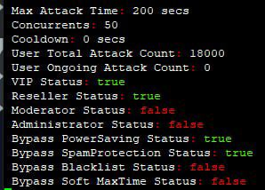
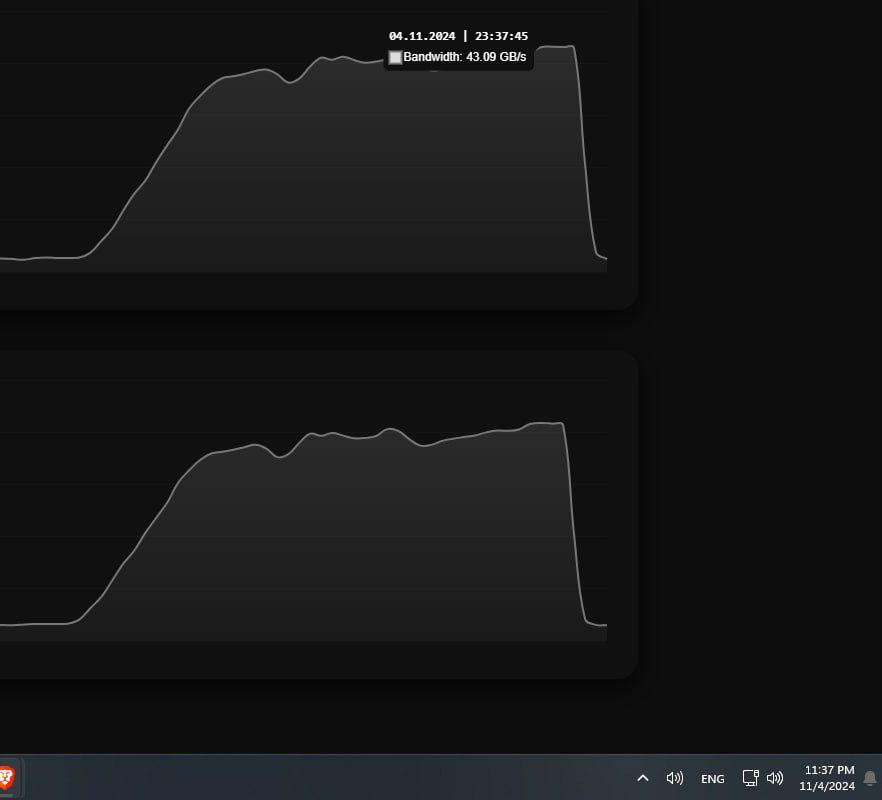
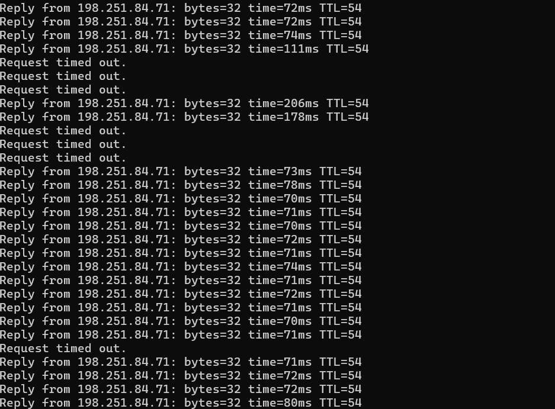

  

<h1 align="center" style="font-size: 60px; font-weight: 900; color: #222; margin-top: 20px;">
  ⚡ UDP FLOODING SAMP – Educational Use Only ⚡
</h1>

  🚀 For <u>FASTEST</u> UDP FLOODING SAMP, run the <code style="font-size: 22px;">.exe</code> version instead of the Python script!

 

  
  
  

<h2 style="font-size: 34px;">⚠️ Disclaimer</h2>

  This tool is created purely for <strong>educational</strong>, <strong>ethical testing</strong>, and <strong>cybersecurity learning</strong> purposes. 
  Do <strong style="color: red;">NOT</strong> use it on unauthorized networks. Doing so may violate strict cybercrime laws.

<h2 style="font-size: 34px;">📁 Setup Instructions</h2>
<ol style="font-size: 20px; line-height: 1.6;">
  <li><strong>Install Python</strong> – Download from <a href="https://www.python.org/downloads/" target="_blank">python.org</a></li>
  <li><strong>Extract Project</strong> – Unzip and open the project folder</li>
  <li><strong>Run the Tool</strong>:
    <ul>
      <li>Click the <code>Ddosstool.exe</code> file (recommended)</li>
      <li>Or run manually via terminal:
         <code>python ddostool.py</code></li>
    </ul>
  </li>
  <li>Enter these when prompted:
    <ul>
      <li><code>Target IP Address</code></li>
      <li><code>Port</code></li>
      <li><code>Number of Threads</code></li>
      <li><code>Duration (seconds)</code></li>
    </ul>
  </li>
  <li>The tool will start <strong>UDP traffic simulation</strong> on your test server</li>
</ol>

<h2 style="font-size: 34px;">📸 Example Screenshots</h2>

  <!-- Main interface screenshot -->
  
    
  <!-- Terminal Interface -->
  
  <!-- Result Output -->
  

<h2 style="font-size: 34px;">🎯 Purpose</h2>
<ul style="font-size: 20px;">
  <li>Simulate UDP traffic for training & defense experiments</li>
  <li>Demonstrate how <strong>anti-DDoS</strong> and <strong>packet filtering</strong> works</li>
  <li>Help protect SA-MP & game servers from abuse</li>
</ul>

<h2 style="font-size: 34px;">🛡️ Legal Notice</h2>

  This is a <strong>white-hat project</strong>. The author is not responsible for misuse. Follow your local cyber laws:

<ul style="font-size: 20px;">
  <li>IT Act – India</li>
  <li>Computer Fraud & Abuse Act – USA</li>
  <li>Cybercrime Directive – EU</li>
</ul>

<h2 style="font-size: 34px;">💡 Why Use This?</h2>
<ul style="font-size: 20px;">
  <li>Raise awareness of <strong>UDP abuse risks</strong></li>
  <li>Learn ethical cybersecurity techniques</li>
  <li>Safely test network hardening techniques</li>
</ul>

<h2 style="font-size: 34px;">👨‍💻 Author Note</h2>

  If you're passionate about <strong>cybersecurity, ethical hacking, or SA-MP server protection</strong>, feel free to fork the repo or reach out for collaboration.

  

